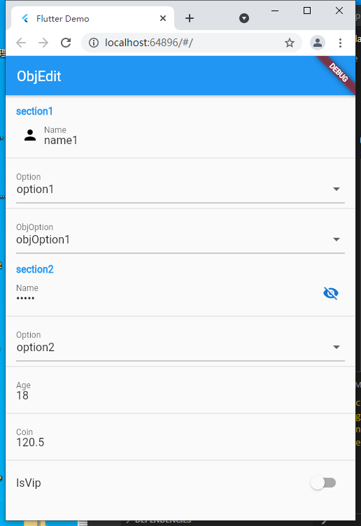

# flutter_obj_editor
auto generate widget from dart class, custom apperence by rewrite "obj_edit_widgets" 

Example:
```dart
import 'package:obj_edit_annotation/obj_edit_annotation.dart';

import 'obj_option.dart';
//flutter pub run build_runner build --delete-conflicting-outputs

@ObjEdit(head: "import 'obj_option.dart';")
class Test {
  @ObjEditTextSetting(
      sectionName: "section1",
      title: "Name",
      hint: "name1",
      icon: "Icons.person")
  String name;
  @ObjEditOptionSetting(
      sectionName: "section1",
      title: "Option",
      options: '<String>["option1","option2","option3"]')
  String option;

  @ObjEditOptionSetting(
      sectionName: "section1",
      title: "ObjOption",
      options:
          '<ObjOption>[new ObjOption("objOption1"),new ObjOption("objOption2"),new ObjOption("objOption3")]')
  ObjOption objOption;

  @ObjEditTextSetting(sectionName: "section2", title: "Name", hint: "name2")
  String name2;
  @ObjEditOptionSetting(
      sectionName: "section2",
      title: "Option",
      options: '<String>["option1","option2","option3"]')
  String option2;

  Test(this.name, this.option, this.objOption, this.name2, this.option2);
}

```
generated widget:


